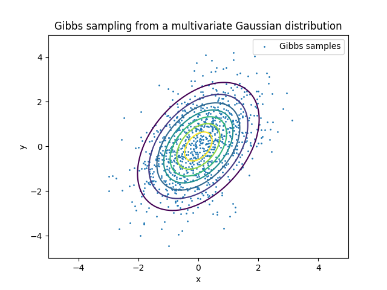

## Introduction

**py-mcmc** provides exemplary implementations of statistical methods for sampling from probability distributions. Of specific interest in this repository are algorithms that construct a Markov chain whose stationary distribution is the target distribution.

